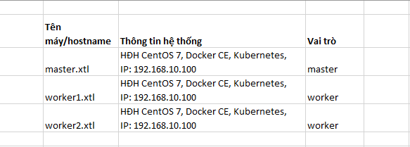

# 1.Tạo kubernetes cluster
- Cần tạo các máy có cấu hình như sau:
- 

- B1: Cài vagrant
- B2: Truy cập folder _[virtual_machine_config/kubernetes-centos7/master]_. Chạy lệnh: `vagrant up` (Nếu lỗi có thể xem hướng dẫn ở project vagrant_guide)
- B3: Test kết quả bằng cách ssh từ máy host vào máy ảo (Mật khẩu là 123). Kết quả như hình sau:
```shell
    hunglp@HungLP MINGW64 /d/Workspace/Learning/learn-kubernetes-cluster/virtual_machine_config/kubernetes-centos7/master (master)
    $ ssh root@172.16.10.100
    The authenticity of host '172.16.10.100 (172.16.10.100)' can't be established.
    ED25519 key fingerprint is SHA256:Ev96w6AWSPnGYByZRiiv3npc2m4PifjlBTRtg4HCEk8.
    This key is not known by any other names
    Are you sure you want to continue connecting (yes/no/[fingerprint])? yes
    Warning: Permanently added '172.16.10.100' (ED25519) to the list of known hosts.
    root@172.16.10.100's password:
[root@master ~]#
```